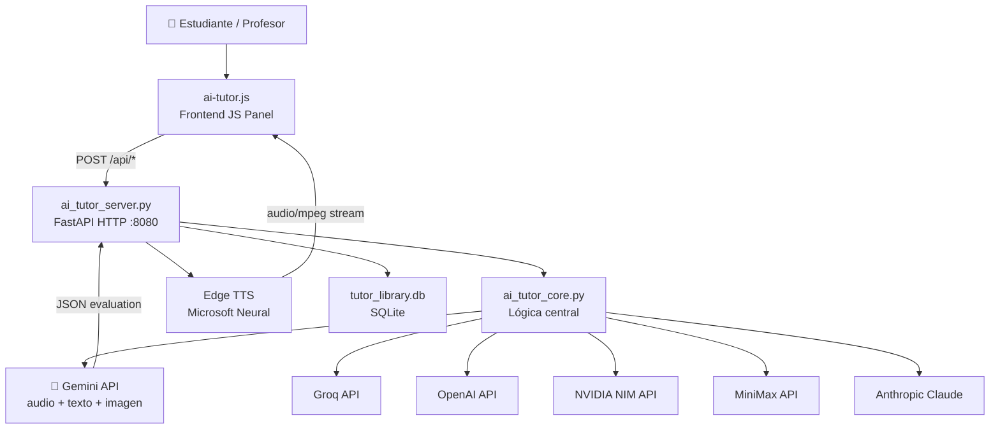
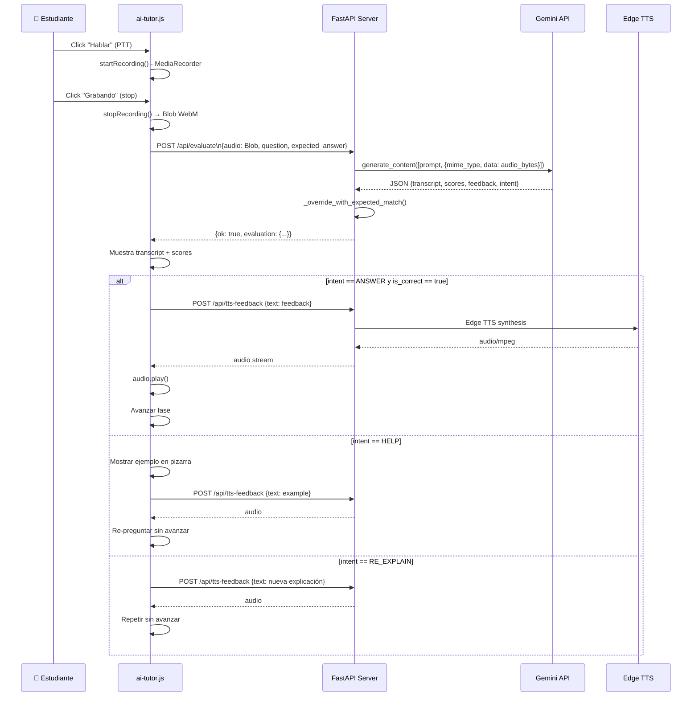

# 🎓 Análisis Detallado: Función AI Tutor

## Descripción General

El AI Tutor es un sistema de tutoría interactiva que combina un **frontend JavaScript** ([`ai-tutor.js`](file:///d:/tablero/ai-tutor.js)) con un **backend FastAPI Python** ([`ai_tutor_server.py`](file:///d:/tablero/ai_tutor_server.py) + [`ai_tutor_core.py`](file:///d:/tablero/ai_tutor_core.py)) para impartir clases estructuradas por fases, evaluar respuestas en audio/texto/imagen, y dar retroalimentación hablada en tiempo real.

---

## 🏗️ Arquitectura General



---

## 📋 Estructura de una Clase (Script)

El tutor trabaja con **scripts JSON** que tienen este esquema (`ai_tutor.lesson.v1`):

```json
{
  "schema": "ai_tutor.lesson.v1",
  "topic": "Present Perfect",
  "level": "A2",
  "subject": "English",
  "phases": [ /* 6 fases para English */ ]
}
```

### Fases por Materia

| Materia | Núm. Fases | Fases |
|---|---|---|
| **English** | 6 | Diagnosis → Engagement → Grammar Explanation → Error Handling → Progressive Practice → Memory Reinforcement |
| **Mathematics** | 5 | Problem Context → Core Concept → Worked Examples → Guided Practice → Mastery Practice |
| **Physics/Chemistry/Biology** | 5 | Phenomenon Observation → Core Concept → Worked Examples → Guided Practice → Experimental Practice |
| **History/Literature/Geography** | 5 | Historical Moment → Core Concept → Sources & Evidence → Analysis & Debate → Synthesis |

Cada fase contiene:
- `tutor_says` — Lo que el tutor lee en voz alta
- `student_task` — La tarea/pregunta para el estudiante
- `expected_answer` — Respuesta esperada (referencia para calificar)
- `key_structure` — Estructura gramatical o clave
- `board_actions` — Instrucciones para la pizarra
- `exercises[]` — Lista de 6 ejercicios para fases de práctica
- `image_prompt` — Prompt para generar imagen educativa

---

## 🔄 Flujo Completo: De Principio a Fin

### PASO 1 — Generación de la Clase

```
Usuario ingresa: Topic + Level + Subject + Context
       ↓
ai-tutor.js → generateLesson()
       ↓
POST /api/generate-lesson  { topic, level, subject, context, api_provider, api_key }
       ↓
ai_tutor_server.py → generate_lesson_script()
       ↓
LLM Provider (Gemini/Groq/etc.) genera JSON de 5-6 fases
       ↓
_normalize_lesson_payload() → limpia y valida el JSON
  • Remueve pistas de respuestas en instrucciones (_clean_revealing_instruction)
  • Normaliza texto para TTS (_normalize_audio_safe_text)
  • Genera image_prompt si falta
       ↓
Guarda en SQLite library + devuelve script al frontend
       ↓
loadScriptObject() → muestra fases en la UI
```

**Generadores de texto soportados para la clase:**

| Proveedor | SDK |
|---|---|
| Gemini | `google.generativeai` |
| Groq | `groq` Python SDK |
| OpenAI | `openai` Python SDK |
| NVIDIA NIM | `openai` compatible |
| MiniMax | `openai` compatible (base_url minimax) |
| Anthropic | `urllib.request` directo |

> [!TIP]
> Si el JSON generado tiene errores, el sistema intenta **3 reparaciones automáticas**: limpieza de trailing commas → `json.loads` → reparación por prompt → prompt más estricto.

---

### PASO 2 — Clase Guiada (Guided Session)

La **Clase Guiada** es el modo automatizado donde el tutor "habla" cada fase y espera la respuesta del estudiante:

```
startGuidedClassFromScript()
       ↓
Pizarra muestra los elementos visuales de la fase
       ↓
ttsSpeak(phase.tutor_says)  ← TTS habla la explicación
       ↓
ttsSpeak(phase.student_task) ← TTS habla la pregunta
       ↓
state.guidedWaiting = true  ← Sistema espera respuesta
       ↓
Estudiante responde (voz o texto)
       ↓
Evaluación → resultado → avanzar o reintentar
```

---

## 🎙️ Sistema de Voz — Cómo Funciona

### A. Captura de Audio (Push-to-Talk)

```javascript
// ai-tutor.js : línea ~4854
async function startRecording() {
    const stream = await ensureSharedStream(); // mic persistente
    const mimeType = pickSupportedMimeType();  // preferencia: audio/webm;codecs=opus
    const recorder = new MediaRecorder(stream, { mimeType });
    
    recorder.ondataavailable = (ev) => state.chunks.push(ev.data);
    recorder.onstop = () => {
        state.recordedBlob = new Blob(state.chunks, { type });
        // listo para evaluar
    };
    recorder.start();
}
```

**Formatos de audio preferidos (en orden):**
1. `audio/webm;codecs=opus`
2. `audio/webm`
3. `audio/ogg;codecs=opus`
4. `audio/mp4`

**Tipos de stream:**

| Modo | Descripción |
|---|---|
| Solo micrófono | `getUserMedia({ audio: true })` |
| Sistema + micrófono | `getDisplayMedia` (sistema) mezclado con `getUserMedia` via `AudioContext` |

> [!NOTE]
> El stream del micrófono se **mantiene vivo** entre grabaciones (`sharedStream`) para evitar que el navegador pida permiso repetidamente.

### B. Síntesis de Voz TTS — El Tutor Habla

```
ttsSpeak(texto)
       ↓
POST /api/tts-feedback { text, voice, rate, pitch }
       ↓
_normalize_for_tts(text) — Normaliza pronunciación ("7am" → "seven a.m.")
       ↓
tts_bytes_sync(text, voice="es-MX-DaliaNeural") — Edge TTS de Microsoft
       ↓
StreamingResponse(audio/mpeg)
       ↓
Frontend: URL.createObjectURL(blob) → new Audio(url) → audio.play()
```

**Si el servidor TTS falla**, hay fallback automático a `SpeechSynthesis` del navegador.

**Voces disponibles:**
- `es-MX-DaliaNeural` — Español (voz principal, Microsoft Edge TTS)
- `minimax/female-shaonv/speech-02-hd` — Si el proveedor es MiniMax

---

## 🧠 Sistema de Evaluación

El AI Tutor soporta **tres modos de evaluación**:

### 1. Evaluación por Audio (modo principal)

```
evaluateRecording()
       ↓
FormData { audio: Blob, topic, level, question, expected_answer, api_provider }
       ↓
POST /api/evaluate
       ↓
ai_tutor_server.py:
  - Proveedor Gemini → evaluate_audio_with_gemini()
  - Proveedor MiniMax → transcribe_student_audio() + evaluate_text_with_provider()
  - Otros → Error (no soportado para audio nativo)
```

#### Cómo Gemini evalúa el audio

```python
# ai_tutor_core.py : línea 2736
def evaluate_audio_with_gemini(audio_bytes, mime_type, topic, level, question, expected_answer):
    model = genai.GenerativeModel('gemini-2.5-flash')
    
    response = model.generate_content(
        [
            prompt,              # instrucciones de evaluación
            {
                'mime_type': mime_type,  # audio/webm
                'data': audio_bytes,     # bytes del audio
            }
        ],
        generation_config={ 'response_mime_type': 'application/json', 'temperature': 0.2 }
    )
```

> [!IMPORTANT]
> Gemini recibe el **audio crudo directamente** (no hay STT separado). El modelo hace **transcripción + evaluación** en una sola llamada multimodal.

El prompt le pide a Gemini que devuelva este JSON estricto:

```json
{
  "intent": "ANSWER | RE_EXPLAIN | TANGENT | HELP",
  "transcript": "Lo que dijo el estudiante",
  "pronunciation_score": 0-100,
  "grammar_score": 0-100,
  "relevance_score": 0-100,
  "overall_score": 0-100,
  "is_correct": true | false,
  "feedback": "Retroalimentación en español",
  "corrected_answer": "La respuesta correcta",
  "tangent_response": "Respuesta si salió del tema",
  "help_example": "Ejemplo si pidió ayuda",
  "next_prompt": "Siguiente instrucción"
}
```

### 2. Evaluación por Texto

```
evaluateTextAnswer()
       ↓
POST /api/evaluate-text { text, topic, level, question, expected_answer, api_provider }
       ↓
evaluate_text_with_provider()
  1. Verificación local rápida (_build_local_text_evaluation):
     - ¿El texto coincide con expected_answer? → correcto directamente
     - ¿Pide ayuda/ejemplo/repetición? → respuesta local inmediata
  2. Si no coincide localmente → LLM (cualquier proveedor)
```

### 3. Evaluación por Imagen (Pizarra)

El estudiante escribe/dibuja en la pizarra y el tutor evalúa la captura de pantalla:

```
POST /api/evaluate-image { image_data_url: "data:image/png;base64,...", question, expected_answer }
       ↓
evaluate_image_with_gemini(image_bytes, mime_type, ...)
       ↓
Gemini analiza la imagen y transcribe/interpreta lo escrito
```

---

## 🎯 Sistema de Calificación — Detalles

### Puntuaciones Devueltas

| Campo | Descripción | Rango |
|---|---|---|
| `pronunciation_score` | Pronunciación (solo audio) | 0-100 |
| `grammar_score` | Gramática | 0-100 |
| `relevance_score` | Relevancia de la respuesta | 0-100 |
| `overall_score` | Puntaje global | 0-100 |
| `is_correct` | ¿Pasó el ejercicio? | true/false |

### Lógica de Override por Coincidencia

Antes de devolver el resultado, el sistema verifica si la respuesta del estudiante **coincide semánticamente** con `expected_answer`:

```python
# ai_tutor_core.py : línea 2589
def _override_with_expected_match(payload, student_answer, expected_answer):
    if _student_matches_expected(student_answer, expected_answer):
        payload['is_correct'] = True
        payload['overall_score'] = max(90, ...)  # mínimo 90
        payload['grammar_score'] = max(85, ...)
        payload['relevance_score'] = max(95, ...)
        payload['pronunciation_score'] = max(80, ...)
```

La coincidencia acepta variaciones: mayúsculas/minúsculas, artículos, puntuación. **No es match exacto.**

### Intenciones Detectadas

| Intent | Qué hace el tutor |
|---|---|
| `ANSWER` | Evalúa normalmente, da feedback y avanza si es correcto |
| `RE_EXPLAIN` | Habla una explicación nueva con palabras distintas |
| `TANGENT` | Responde brevemente la pregunta fuera de tema y redirige |
| `HELP` | Da un ejemplo en la pizarra + habla el ejemplo + re-pregunta |

### Detección Local de Intento (sin LLM)

```python
# Palabras clave locales (sin llamar API)
re_explain_markers = ['no entiendo', 'repeat', 'otra vez', 'again please', ...]
help_markers = ['help', 'ayuda', 'i don\'t know', 'no se', 'ejemplo', ...]
```

Si el estudiante dice alguna de estas frases cortas (< 12 palabras), la respuesta se maneja **localmente** sin gastar tokens de API.

---

## 📡 Endpoints del Servidor

| Método | Ruta | Función |
|---|---|---|
| `POST` | `/api/generate-lesson` | Genera clase JSON con LLM |
| `POST` | `/api/generate-practice` | Genera práctica libre |
| `POST` | `/api/evaluate` | Evalúa audio (Gemini/MiniMax) |
| `POST` | `/api/evaluate-text` | Evalúa texto escrito |
| `POST` | `/api/evaluate-image` | Evalúa captura de pizarra |
| `POST` | `/api/tts-feedback` | Sintetiza texto a audio (Edge TTS) |
| `POST` | `/api/completion` | Llamada directa a cualquier LLM |
| `POST` | `/api/generate-drawing-plan` | Plan para pizarra con Gemini |
| `POST` | `/api/generate-drawing-image` | Imagen educativa con Gemini |
| `POST` | `/api/generate-drawing-svg` | SVG educativo con Gemini |

---

## 🔑 Configuración de API por Ruta

El sistema tiene **4 rutas de API configurables independientemente**:

| Ruta | Propósito | Proveedor por defecto |
|---|---|---|
| `generation` | Generar la clase en texto | Cualquier LLM |
| `text` | Evaluar respuestas escritas | Cualquier LLM |
| `audio` | Evaluar audio del estudiante | **Gemini** (obligatorio) |
| `image` | Generar imágenes + evaluar pizarra | **Gemini** (obligatorio) |

El servidor tiene **API keys hardcodeadas como fallback** con rotación automática:
- `GEMINI_KEY_LESSON` — Para generar clases
- `GEMINI_KEY_IMAGE` — Para imágenes
- `GEMINI_KEY_SVG` — Para SVGs
- `GEMINI_KEY_FALLBACK` — Para todo lo demás

---

## 🎨 Modos de Operación

### Modo Guiado (Clase Guiada)
- El tutor **habla automáticamente** cada fase via TTS
- Espera respuesta en audio o texto
- Avanza automáticamente si la respuesta es correcta
- Muestra la pizarra sincronizada con la fase

### Modo Práctica Libre
- El estudiante elige el tema de práctica
- Genera ejercicios específicos sin estructura de clase completa
- Evaluación bajo demanda (sin avance automático)

---

## 🛡️ Mecanismos de Protección

1. **Anti-giveaway**: [`_clean_revealing_instruction()`](file:///d:/tablero/ai_tutor_core.py#L249) elimina automáticamente la respuesta correcta del enunciado del ejercicio (ej: "usa *went*" → "usa la forma correcta")

2. **Texto audio-seguro**: [`_normalize_audio_safe_text()`](file:///d:/tablero/ai_tutor_core.py#L221) reemplaza referencias visuales ("mira la imagen") por referencias auditivas ("imagina la escena")

3. **Reparación de JSON**: 3 intentos automáticos si el LLM devuelve JSON malformado

4. **Fallback de TTS**: Si Edge TTS falla → `SpeechSynthesis` del navegador

5. **Stream persistente**: El micrófono se mantiene abierto entre grabaciones

---

## 📊 Flujo Completo de Evaluación de Audio (diagrama)



---

## 📁 Archivos Clave

| Archivo | Rol |
|---|---|
| [`ai-tutor.js`](file:///d:/tablero/ai-tutor.js) | Frontend completo (6,331 líneas): UI, grabación, TTS, evaluación |
| [`ai_tutor_server.py`](file:///d:/tablero/ai_tutor_server.py) | FastAPI server: endpoints REST, routing de API |
| [`ai_tutor_core.py`](file:///d:/tablero/ai_tutor_core.py) | Lógica central: providers, evaluación, generación, TTS |
| [`ai_tutor_library.py`](file:///d:/tablero/ai_tutor_library.py) | CRUD de clases guardadas en SQLite |
| [`tts_normalizer.py`](file:///d:/tablero/tts_normalizer.py) | Normalización de texto para TTS |
| [`lesson_protocol.txt`](file:///d:/tablero/lesson_protocol.txt) | Plantilla de prompt para generar clases |
| `lesson_protocol_*.txt` | Plantillas por materia (English, Math, Science, etc.) |
